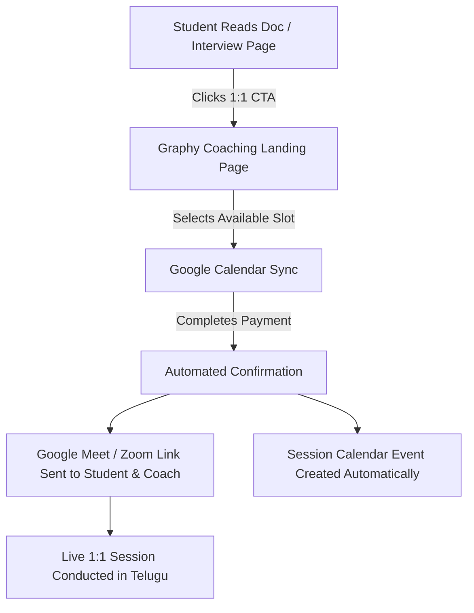
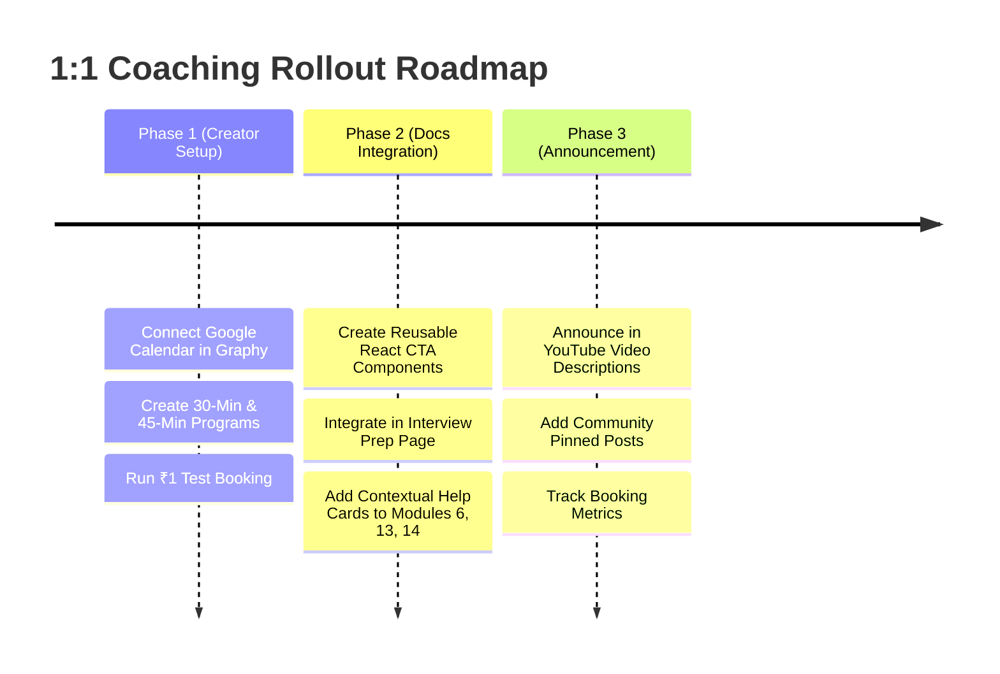

# Graphy 1:1 Coaching Integration & Monetization Architecture

> **Document Status**: Production Architecture & Implementation Blueprint  
> **Target Platform**: Think IT Telugu (`python.thinkittelugu.in` & Graphy LMS)  
> **Audience**: AI Agents, Instructors, Content Strategists  

---

## 1. Vision & Strategic Purpose

While the open-source documentation website (`python.thinkittelugu.in`) and YouTube video tutorials provide free, self-paced foundational education in Telugu, beginners frequently hit roadblocks when:
1. **Debugging Tricky Errors**: Syntax bugs, nested loop confusion, or object-oriented architecture hurdles.
2. **Technical Interview Fears**: Freshers and non-CS career switchers lack confidence in answering live technical interview questions.
3. **Career Roadmap Uncertainty**: Students transitioning from non-IT backgrounds need personalized learning paths to enter software engineering and AI/ML.

Graphy's **1:1 Coaching System** bridges this gap by enabling high-converting, automated, paid 1-on-1 mentorship directly tied to our documentation content.

---

## 2. Technical Capabilities of Graphy 1:1 Coaching

Based on Graphy's coaching infrastructure (`Products -> Coaching`), the system automates end-to-end booking, calendar syncing, meeting generation, and payments:

### A. Core Engine Workflow


### B. Creator Setup Lifecycle (Admin Dashboard)
1. **Landing Page Configuration**:
   - **Program Name**: High-intent, crystal-clear title (up to 100 chars).
   - **Description**: Detailed session agenda, prerequisites, and expected outcomes (up to 1,000 chars).
   - **Cover Image**: Standard 4:3 aspect ratio (e.g., `1200x900px`).
   - **Pre-Booking FAQs**: Answers addressing prerequisites, language of communication (Telugu/English), and recording availability.
2. **Calendar & Coach Integration**:
   - **Direct Google Calendar Connection**: Integrates with instructor's calendar to automatically display only available, non-conflicting time slots.
   - **Multi-Coach Support (Round-Robin)**: Capability to assign multiple teaching assistants/coaches with custom weights (1 to 10) for automated session distribution.
   - **Customizable Duration**: Configure exact session lengths (e.g., 30 mins, 45 mins, 60 mins).
3. **Pricing & Access Models**:
   - **Free**: For introductory trials or priority scholarships.
   - **One-Time Fee**: Fixed session fee (with optional sale discount badge).
   - **Subscription**: Recurring periodic coaching.
   - **Fee Management**: Configurable toggle to absorb or pass gateway transaction fees.
4. **Post-Booking Management**:
   - Automated self-serve rescheduling for students.
   - Centralized recordings and transcript storage in Graphy Admin.

---

## 3. Think IT Telugu Product Lineup (Coaching Catalog)

| Product | Target Audience | Duration | Recommended Price | Key Value Delivered |
| :--- | :--- | :--- | :--- | :--- |
| **Python Code Debugging & Doubt Solving** | Students stuck on exercises, loops, OOP | 30 Mins | ₹199 – ₹299 | Screen-share live debugging, concept clarification in Telugu. |
| **1:1 Python Technical Mock Interview** | Job seekers & college freshers | 45 Mins | ₹499 – ₹699 | Live coding test, theoretical cross-examination, resume critique. |
| **Python-to-AI Career Transition Strategy** | Non-CS / Career switchers | 45 Mins | ₹499 – ₹799 | Custom learning roadmap, portfolio guidance, job search strategy. |

---

## 4. Documentation Integration Strategy (Where & How)

To maintain maximum credibility and pedagogical integrity, coaching links must **NEVER** feel spammy or intrusive. They must be presented as **contextual support solutions** right where students experience friction.

### Placement Matrix

```
python.thinkittelugu.in
├── /python-interview-questions   --> Primary Placement: 1:1 Live Mock Interview Card
├── /online-python-compiler       --> Secondary: "Need help debugging your code live?"
├── docs/part-1/module-6-loops    --> Module End: "Stuck on Nested Loops?"
├── docs/part-3/module-13-oop     --> Module End: "Stuck on OOP Architecture?"
└── docs/part-3/module-14-errors  --> Module End: "Need help solving complex exceptions?"
```

### Official Live Booking URL
- **Production URL**: `https://www.thinkittelugu.in/coaching/11-Python-Concept-Mastery--Personal-Mentorship-Telugu-6a3d2f405a77f6172bb6a5e8`

### 1. Dedicated CTA in `/python-interview-questions`
Place a high-converting card directly below the interview pillars:
```jsx
<div className="coaching-promo-banner">
  <div className="coaching-promo-badge">Live 1-on-1 Mentorship</div>
  <h3>Need 1-on-1 Personal Guidance & Doubt Resolution?</h3>
  <p>
    Get your Python questions, conceptual doubts, and tricky logic clarified step-by-step 
    in friendly Telugu & English with Sai Kumar.
  </p>
  <a href="https://www.thinkittelugu.in/coaching/11-Python-Concept-Mastery--Personal-Mentorship-Telugu-6a3d2f405a77f6172bb6a5e8" target="_blank" rel="noopener noreferrer" className="coaching-cta-btn">
    Book a 1:1 Live Session
  </a>
</div>
```

### 2. Contextual "Stuck on Code?" Card in Complex Modules
At the end of difficult lessons (e.g. OOP, Nested Loops, Recursion, Regex), insert a contextual doubt-clearing component:
```jsx
<CardGroup cols={1}>
  <Card title="Need 1-on-1 Personal Concept Clarity?" icon="code">
    Stuck on this concept or need step-by-step personal explanation in Telugu?
    Book a dedicated 1:1 live session on Google Meet.
    <br />
    <a href="https://www.thinkittelugu.in/coaching/11-Python-Concept-Mastery--Personal-Mentorship-Telugu-6a3d2f405a77f6172bb6a5e8" target="_blank" rel="noopener noreferrer" style={{ fontWeight: 600, color: 'var(--ifm-color-primary)' }}>
      Book 1:1 Live Session &rarr;
    </a>
  </Card>
</CardGroup>
```

---

## 5. UI/UX Rules for AI Agents

When building or updating React components for 1:1 coaching:
1. ❌ **Zero Emojis**: Strictly follow the repository's brand rule—use clean SVG icons instead of emojis (`🚀`, `🎯`, `💡`).
2. 🔒 **Open in New Tab**: All external Graphy booking links must include `target="_blank"` and `rel="noopener noreferrer"`.
3. 🎨 **Dark/Light Theme Responsive**: Utilize CSS variables (`var(--ifm-color-primary)`, `var(--pylab-card-bg)`) to ensure seamless styling in both light and dark themes.
4. 📱 **Mobile-First Layout**: Ensure callout cards and buttons have full-width padding and touch-friendly tap targets (`min-height: 44px`).

---

## 6. Phased Rollout Playbook



1. **Phase 1: Creator Dashboard Configuration**
   - Admin goes to `Products -> Coaching -> + Create`.
   - Connect Google Calendar and establish working hours.
   - Generate live URLs for *Doubt Clearance* and *Mock Interview*.
2. **Phase 2: Documentation Integration**
   - Create a reusable `<CoachingCard />` component in `src/components/CoachingCard/`.
   - Embed dynamically into `/python-interview-questions` and selected high-friction doc pages.
3. **Phase 3: Community & Growth**
   - Mention 1:1 mentorship in YouTube video conclusions and Community tab.
   - Monitor Graphy booking metrics (`Total Bookings`, `Total Revenue`).
